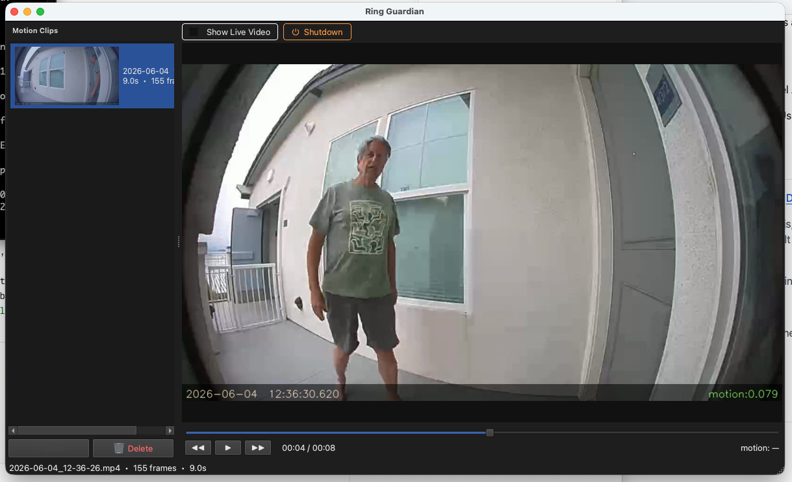

# Ring Guardian

Connects to your Ring doorbell's live stream, detects motion, and saves motion events as timestamped MP4 clips. A PyQt6 GUI lets you browse, play, scrub, and delete clips — including a live camera view.

No Ring Protect subscription required.



---

## Credits

Ring Guardian's Node.js bridge is built on [ring-client-api](https://github.com/dgreif/ring) by **Dylan Greif** — an impressive piece of reverse-engineering that decodes Ring's undocumented OAuth and WebRTC protocols. Without that work this project wouldn't exist. Thanks Dylan.

> Note: `ring-client-api` is unofficial and unaffiliated with Ring / Amazon. It could break if Ring changes their backend.

---

## Requirements

| Tool | Min version | Install |
|------|-------------|---------|
| Python | 3.13 | https://python.org or `brew install python` |
| uv | any | `brew install uv` or `curl -LsSf https://astral.sh/uv/install.sh \| sh` |
| Node.js | 18 | https://nodejs.org or `brew install node` |
| ffmpeg | any recent | `brew install ffmpeg` |
| Rust | stable (optional) | https://rustup.rs — recommended on slower machines |

---

## Installation

```bash
git clone https://github.com/j0el/ring_doorbell.git
cd ring_doorbell

# Node.js bridge dependencies
npm install

# Python dependencies (uv creates the venv automatically)
uv sync
```

---

## Authentication

Ring Guardian handles authentication entirely within the app — no command-line token steps required.

### First-time setup

On first launch (when no `ring_token.json` exists), a **Sign in to Ring** dialog appears automatically. Enter your Ring account email and password. If your account uses 2FA, you'll be prompted for the code after signing in.

The refresh token is saved to `ring_token.json` and reused on every subsequent launch.

> **Important:** `ring_token.json` is in `.gitignore` and should never be committed. It contains credentials that grant full access to your Ring account.

### Token renewal

Ring tokens auto-renew during an active session. If a token expires (after ~60 days of inactivity or if Ring detects suspicious use), simply delete `ring_token.json` and relaunch — the sign-in dialog will appear again.

```bash
rm ring_token.json
uv run python main.py --camera "Front Door"
```

---

## Usage

### List your cameras

```bash
uv run python main.py --list
```

### Start capture + GUI

```bash
uv run python main.py --camera "Front Door"
```

### Browse saved clips without capturing

```bash
uv run python main.py --gui-only
```

---

## GUI features

| Feature | How |
|---------|-----|
| Play / pause clip | Click ▶ or click the clip |
| Scrub | Drag the timeline slider |
| Step frame | ◀◀ / ▶▶ buttons |
| Select multiple clips | Shift+click or Cmd+click |
| Delete selected | Click 🗑 Delete (no confirmation) |
| Undo last delete | Click ↩ Undo — files go to `clips/.trash/` and are fully restored on undo |
| Live camera feed | Check **Show Live Video** (starts checked; visible only during active capture) |
| Shutdown | Click **⏻ Shutdown** to stop all capture threads and close |

---

## CLI flags

```
uv run python main.py --camera "Front Door" [options]
```

| Flag | Default | Description |
|------|---------|-------------|
| `--width` | 1280 | Capture frame width |
| `--height` | 720 | Capture frame height |
| `--fps` | 15 | Frames per second |
| `--threshold` | 0.005 | Total motion pixel fraction to trigger detection (0–1) |
| `--min-blob` | 0.01 | Minimum contiguous moving region as fraction of frame — filters reflections and small flickers |
| `--min-frames` | 5 | Consecutive motion frames required before a clip starts — filters single-frame flashes |
| `--pre-roll` | 15 | Frames captured before motion starts |
| `--post-roll` | 3.0 | Seconds of quiet before a clip is closed |
| `--output-fps` | 15.0 | FPS written to saved MP4 |
| `--node` | `node` | Path to the `node` binary if not in PATH |

### Tuning motion sensitivity

Too many false positives (reflections, passing headlights, shadows):

```bash
uv run python main.py --camera "Front Door" --min-blob 0.015 --min-frames 6
```

Missing real events:

```bash
uv run python main.py --camera "Front Door" --threshold 0.003 --min-blob 0.002 --min-frames 2
```

---

## Rust motion backend (recommended)

The default backend uses Python/OpenCV for motion detection. On faster machines this is fine, but on slower processors the Python pipeline can fall behind the camera feed, causing brief or fast-moving subjects to slip through undetected between processed frames.

The included Rust backend processes frames at ~200 fps on a single core — an order of magnitude faster than Python — keeping up with any camera feed without dropping frames. This makes a real difference for:

- **Brief events**: someone walking quickly past the frame
- **Small motions**: a hand, a pet, a package drop
- **Slower machines**: older Macs, laptops, or any machine where Python CPU usage is high

### Building

```bash
# Install Rust if you haven't already
curl --proto '=https' --tlsv1.2 -sSf https://sh.rustup.rs | sh
source ~/.cargo/env

# Build the motion detector
cd motion_core
cargo build --release
```

The binary lands at `motion_core/target/release/motion_core`. Ring Guardian auto-detects it on the next run — no other changes needed.

---

## File layout

```
ring_doorbell/
├── main.py               Entry point and CLI
├── ring_bridge.js        Node.js: authenticates with Ring, streams raw BGR24 frames to stdout
├── ring_capture.py       Spawns bridge subprocess, reads frames into Python
├── motion.py             Motion detection (Rust or OpenCV MOG2 fallback)
├── recorder.py           Writes MP4 clips to clips/ with timestamp overlay
├── gui.py                PyQt6 GUI: clip browser, player, live view
├── ring_auth.py          In-app Ring sign-in dialog
├── package.json          Node.js dependencies (ring-client-api)
├── pyproject.toml        Python dependencies
├── motion_core/          Rust motion detector (optional but recommended)
│   ├── Cargo.toml
│   └── src/main.rs
└── clips/                Saved clips and thumbnails (git-ignored)
    ├── index.json        Clip metadata index
    └── .trash/           Clips pending undo-delete
```

`ring_token.json` is created at the project root after authentication. It is git-ignored — never commit it.
